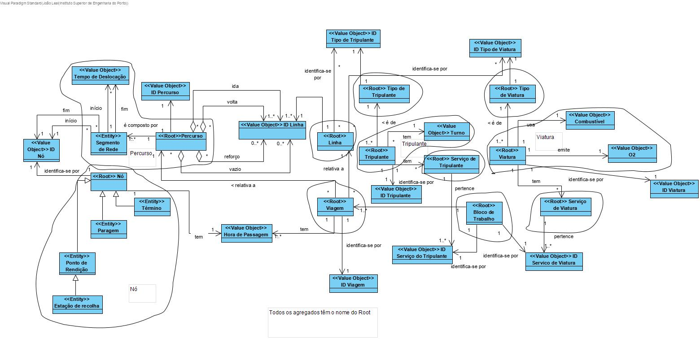

# Documentação do projeto OPT - LAPR5

### Modelo de Domínio

| Sprints                |   Datas  |
| ---------------------- |----------|
| Sprint A               |15-11-2020|
| Sprint B               |06-12-2020|
| Sprint C               |03-01-2021|
| Sprint D               |24-01-2021|

## Design Arquitetural

[Nível 1](./documentacao/DesignArquitetural/Nivel1/home.md)

[Nível 2](./documentacao/DesignArquitetural/Nivel2/home.md)

[Nível 3](./documentacao/DesignArquitetural/Nivel3/home.md)

## Design de casos de uso - Nível 3

[Bruno Veiga - 1180712](./documentacao/1180712/home.md)

[João Leal - 1180723](./documentacao/1180723/home.md)

[Pedro Brandão - 1180715](./documentacao/1180715/home.md)

[Bruno Ribeiro - 1180573](./documentacao/1180573/home.md)

